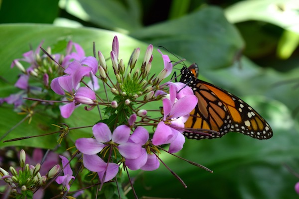

# Photos to Needlework Designs

# Introduction
This project takes a photo as input, and creates a cross-stitch needlework pattern as output with the specified number of colors and canvas background color. I computationally found the best set of colors, and ensured that detail is not lost by applying well-defined edges, vivid colors, high detail in the foreground, and subtle backgrounds.


# Background
A cross-stitch needlework pattern is a “map” of stitches and their corresponding DMC embroidery floss color. There are about 450 colors of DMC embroidery floss, but a cross-stitch needlework pattern generally utilizes only about 10 - 30 unique colors. Generally, this restriction on the number of colors causes a noticeable loss of detail in the purple flower petals, as colors are wastefully “used up” on the background. Edges are less noticeable in the output image, especially where many of the flower stems appear broken or discontinuous.

I wanted to improve the algorithm to maintain sharp detail in the important areas (the flower petals and butterfly). I implemented the steps to reduce the number of colors in an image to a user-specified number and convert these colors into DMC colors, outline important features, and separate foreground from background. Each pixel in the output image corresponds to 1 stitch in a cross-stitch needlework pattern.

# Language
Python 2.7

# Packages
The following libraries/packages are needed:
- cv2
- random
- scipy.stats
- scipy.ndimage
- numpy
- matplotlib.pyplot

# How to Use

--Command Line Instructions--

``` python
# To generate the pattern, type:
python cross_stitch_pattern.py -f [JPG input image filename] -o [output image filename] -n [number of colors] -c [canvas color (0 for black, 1 for white)]

# For example, the following command will create a pattern with 24 colors on a white canvas:
python cross_stitch_pattern.py -f images/birds_input.jpg -o images/birds_output.jpg -n 24 -c 1
```

Note that a 600x400 image can take about 10 minutes to process 20 colors.

# Sample Output

Input Image             |  Output Image
:-------------------------:|:-------------------------:
  |  
  |  
  |  
  |  


